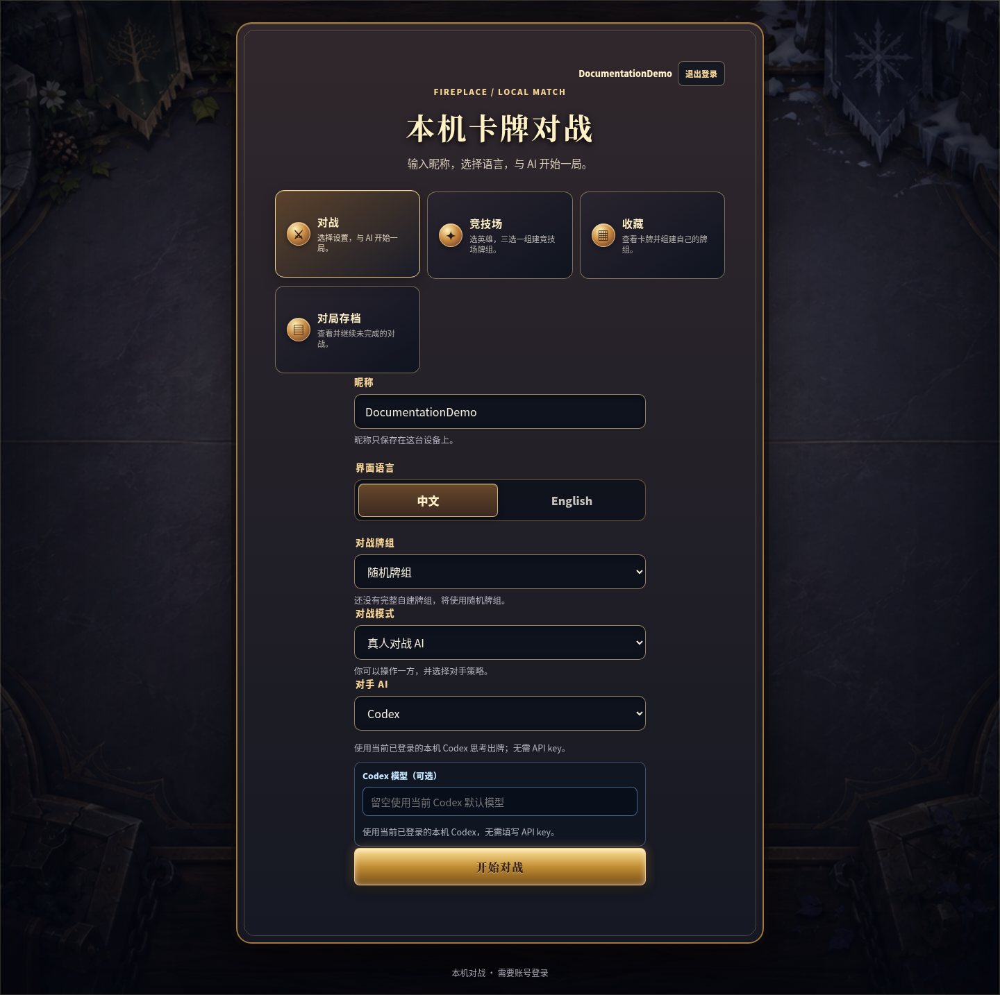
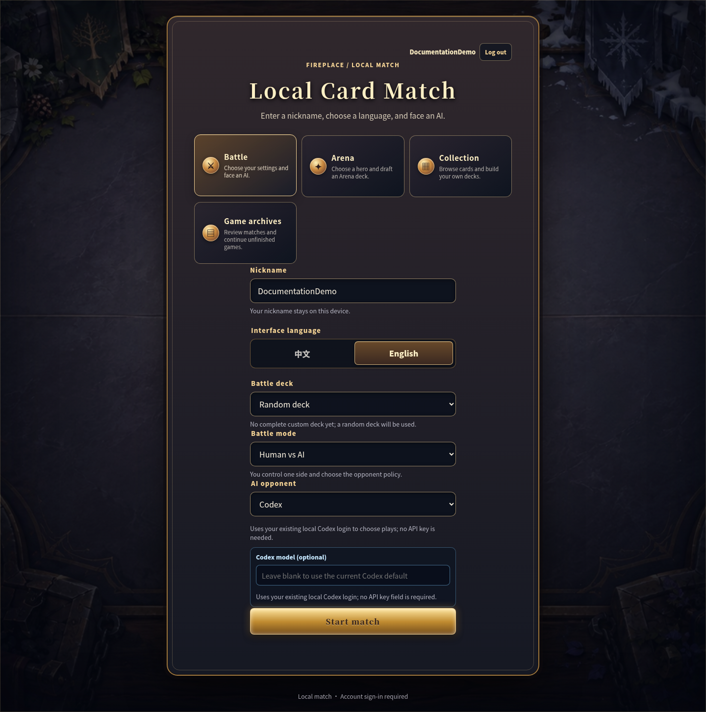

# TavernLab-HSsim

[中文](#中文) · [English](#english)

## 项目介绍 / Introduction

本项目是在 [HearthSim Fireplace](https://github.com/jleclanche/fireplace) 基础上继续开发的开源《炉石传说》本地模拟与 AI 实验项目。底层游戏规则、卡牌实体和大量基础模拟代码继承自 Fireplace；在此基础上，本项目增加了本机浏览器 GUI、竞技场、收藏与卡组管理、本地账号、多种 Agent/AI、对局日志与回放等功能。

项目目前主要面向本地模拟、历史版本体验和 AI/Agent 实验，不连接 Battle.net，也不以替代当前官方《炉石传说》客户端为目标。

This project is an open-source local Hearthstone simulator and AI experimentation platform developed on top of [HearthSim Fireplace](https://github.com/jleclanche/fireplace). Its core game rules, card entities, and a substantial part of the underlying simulation code are inherited from Fireplace. This project extends that foundation with a local browser GUI, Arena, collection and deck management, local accounts, multiple AI/agent controllers, game logging, and replay support.

The project is primarily intended for local simulation, historical Hearthstone environments, and AI/agent experimentation. It does not connect to Battle.net and is not intended to replace the current official Hearthstone client.

本文的“当前功能”指当前仓库源码，不等同于已发布的 v0.1.0-alpha 完整源码 ZIP。该 ZIP 是对应发布版本的历史资产；Codex 对战、Codex/MCTS 观战、人类房间和可选局域网访问等较新的功能，应按包含这些功能的当前源码或对应分支运行。

“Current” below refers to the current repository source, not to the published v0.1.0-alpha full-source ZIP. That ZIP is a historical asset for its release version; newer features such as Codex battles, Codex/MCTS spectators, human rooms, and opt-in LAN access require source from a revision that contains them.

## 截图 / Screenshots

以下中英文截图来自本项目实际运行的本机界面，使用临时演示账号。界面内仍有部分 Fireplace 名称，Python 包名继续使用 <code>fireplace</code>。

These Chinese and English screenshots come from the running local application with a temporary demo account. Some interface labels and the Python package name still use <code>fireplace</code>.

### 中文界面 / Chinese UI

| 开始界面 / Start screen | 对战 / Battle |
| --- | --- |
|  |  |
| 竞技场 / Arena | 收藏与组卡 / Collection and deck building |
|  |  |

卡牌浏览 / Card catalog:

### English UI / 英文界面

| Start screen | Battle |
| --- | --- |
|  |  |
| Arena | Collection and deck building |
|  |  |

Card catalog:

## 中文

### 当前功能状态

| 功能 | 状态 | 当前范围 |
| --- | --- | --- |
| 核心模拟与动作 API | 可用，持续完善 | 基于 Fireplace 的规则与实体；部分卡牌效果尚未完整实现。 |
| 浏览器对战 | 可用 | 普通对战可选择激进策略、MCTS 或 Codex；还可选择 Codex vs MCTS、Codex vs Codex 观战。人类对战通过双席房间进行；随机牌组或完整的自建卡组可用。详见[对战模式与 Codex 说明](docs/codex-battles.md)。 |
| 竞技场 | 可用 | 自选版保留原有规则（7 胜/3 负）；2016 历史版固定卡池，AI 按 Lightforge 评分完成 30 轮三选一（12 胜/3 负）。详见[模式与限制](docs/arena-formats.md)。 |
| 卡牌目录与收藏 | 可用 | 浏览、搜索、筛选历史卡牌资料，并创建和保存卡组；不是官方账号的卡牌库存。 |
| 本地账号 | 可用 | 用户名和密码登录；卡组、竞技场进度和活动对局按账号隔离。 |
| Agent/AI | 可用，实验性 | 普通对战可选择激进策略、MCTS 或 Codex，竞技场固定使用 MCTS；另有 Codex vs MCTS 和 Codex vs Codex 观战。 |
| 对局存档与回放 | 可用 | 普通对战和竞技场按账号保存，可查看记录、继续未完成对局和下载已结束日志；人类房间使用服务器范围的共享房间存储并支持重连。恢复会验证规则代码、卡牌数据、运行时版本、动作及恢复检查点中的状态与 RNG；完整日志回放会验证结果、最终状态，并在日志包含时验证 RNG 检查点。个人 GUI 存档只在完整校验通过后迁移已审计的源代码兼容路径。详见[对局存档说明](docs/game-archives.md)。 |
| 局域网/在线 PvP | 局域网可选 | 默认只监听本机回环地址；显式绑定非回环地址时必须提供精确的 `--allow-host` 主机白名单，可配合 TLS。项目不提供 Battle.net 或在线匹配。 |

### 版本与卡牌支持范围

| 层次 | 当前范围 |
| --- | --- |
| 卡牌资料 | 基础 <code>CardDefs.xml</code> 保持历史 build **53261**；通灵学园单独叠加首发 **18.0.0.54613** 数据，不更新其他扩展包。目录中有 **2,641** 条可收集记录（不含英雄皮肤）；合并 XML 共 **9,573** 条记录。 |
| 扩展包 | 基础、经典及多个历史扩展包，扩展至**通灵学园首发版**；通灵学园 **135/135** 张可收集卡已接入效果脚本及行为测试。见[实现与验证说明](docs/scholomance-implementation.md)。 |
| 卡牌效果 | 目录中的“有 Python 定义”只表示找到了对应或复用的代码定义，**不保证**效果完整、可正常加入对局或与官方规则完全一致；部分卡牌目前是白板。 |
| 竞技场卡池 | 自选版：基础与经典固定加入；从 **15 个大包、5 个小包**中使用 **14–18 点**选择扩展包（大包 3 点、小包 1 点）。历史版：固定 2016-09-02 九系列 card ID manifest。两个模式均提供 9 个经典职业英雄。 |

旧版 Fireplace README 的卡牌完成度百分比保存在[历史文档](LEGACY_FIREPLACE_README.md)，不代表 TavernLab-HSsim 当前的可玩效果覆盖率。

### 项目边界与声明

TavernLab-HSsim 是**免费、开源、非官方**的本地研究项目，源码按 [AGPL-3.0-or-later](LICENSE) 发布。项目继承并注明了上游 Fireplace；它与 Blizzard Entertainment 或 Battle.net 没有隶属关系，也未获其赞助或认可。《炉石传说》名称、图像及相关素材的权利归各自权利人所有。

项目不提供 Battle.net 登录、官方客户端兼容或在线匹配。服务器默认只接受本机回环访问；人类房间可通过显式主机白名单提供局域网访问，并可使用 TLS。当前的账号隔离只适用于这台本机服务器；卡牌资料范围和效果实现情况也不应被理解为现行官方《炉石传说》的完整复刻。

### 安装与启动

需要 **Python 3.10+** 和 [Git LFS](https://git-lfs.com/)；<code>CardDefs.xml</code> 使用 Git LFS。以下命令适用于 Linux 和 macOS：

~~~bash
git lfs install
git clone https://github.com/Hanqi-b/TavernLab-HSsim.git
cd TavernLab-HSsim
python3 -m venv venv
source venv/bin/activate
python -m pip install -e .
python -m fireplace.web_gui
~~~

在本机打开 [http://127.0.0.1:8765/](http://127.0.0.1:8765/)，注册本地账号后进入对战、竞技场或收藏。按 <code>Ctrl+C</code> 停止服务。可用 <code>--port 8766</code> 更改端口，或用 <code>--seed 7</code> 固定随机种子；安装后也可运行 <code>tavernlab-web</code>，原 <code>fireplace-web</code> 命令继续可用。账号数据默认保存在 <code>~/.local/state/fireplace/</code>；新的 <code>TAVERNLAB_ACCOUNT_STATE</code>、<code>TAVERNLAB_ACCOUNT_DATA_ROOT</code>、<code>TAVERNLAB_DECK_STATE</code> 和 <code>TAVERNLAB_ARENA_STATE</code> 可分别覆盖存储位置，旧 <code>FIREPLACE_*</code> 环境变量仍然有效。

下载 [v0.1.0-alpha 完整源码 ZIP](https://github.com/Hanqi-b/TavernLab-HSsim/releases/download/v0.1.0-alpha/TavernLab-HSsim-v0.1.0-alpha-full-source.zip) 时无需 Git LFS；此文件包含完整的 <code>CardDefs.xml</code>。GitHub 自动生成的 Source code ZIP/TAR 可能只有 LFS 指针，请使用上述完整包或通过 Git LFS 克隆。

Codex 对战、双控制器观战、人类房间和局域网访问的启动与使用方式见[对战模式与 Codex 说明](docs/codex-battles.md)。

大厅和竞技场的“对局存档”入口可以查看按账号自动保存的对局。服务重启后，从这里继续未完成对局；已结束对局可下载 JSON 日志。人类房间由服务器范围的共享房间存储恢复，详见[对局存档说明](docs/game-archives.md)。

终端对战及回放：

~~~bash
python examples/human_vs_heuristic.py --seed 7 --log games/match.json
python examples/human_vs_heuristic.py --opponent radical --seed 7
python examples/human_vs_heuristic.py --opponent mcts --seed 7
python examples/replay_log.py games/match.json
~~~

### 搜索 AI

激进策略采用费用背包选牌、人工出牌优先级和局部攻击搜索；MCTS 联合搜索出牌、目标、攻击和英雄技能的顺序。两者参考 `xjw580/Hearthstone-Script` 的算法结构，用 Python 接入 Tavern 的规则引擎，普通对战默认使用激进策略，竞技场固定使用 MCTS，原有 AI 的对局入口已关闭。用 `GameSession` 运行搜索 Agent；直接调用普通 `choose_action` 时没有模拟接口，会采用可用的基础策略。

搜索仅处理当前回合，使用独立局面和随机数。未知牌库、敌方手牌和未知奥秘使用占位状态；未知抽牌不能被当成真实卡牌打出。发现等待选择效果会结束模拟分支，由真实控制器处理选择后重新搜索。这些策略仍依赖现有卡牌脚本，不能据此推断对局胜率。见[算法与接口说明](docs/search-agents.md)。

## English

### Current feature status

| Feature | Status | Current scope |
| --- | --- | --- |
| Simulation core and Action API | Available, evolving | Built on Fireplace rules and entities; some card effects remain incomplete. |
| Browser battles | Available | Normal battles offer Radical, MCTS, or Codex; the lobby also offers Codex vs MCTS and Codex vs Codex spectator modes. Human versus human uses two-seat rooms. Random and completed custom decks are supported. See [battle modes and Codex](docs/codex-battles.md). |
| Arena | Available | Custom keeps the existing rules (7 wins/3 losses). The 2016 format uses a fixed pool and 30 Lightforge-scored AI picks (12 wins/3 losses). See [formats and limitations](docs/arena-formats.md). |
| Card catalog and Collection | Available | Browse, search, and filter historical card data; build and save decks. This is not an official account card inventory. |
| Local accounts | Available | Username/password sign-in; decks, Arena progress, and active matches are separated by account. |
| Agents/AI | Available, experimental | Regular battles offer Radical, MCTS, or Codex; Arena always uses MCTS. Codex vs MCTS and Codex vs Codex spectator modes are also available. |
| Game archives and replay | Available | Normal battles and Arena games save per account; view history, resume unfinished games, and download finished logs. Human rooms use server-wide shared room storage and support reconnecting. GUI restore validates rules code, card data, runtime versions, every action, and the recovery checkpoint’s state and RNG; full log replay validates the result and final state, plus an RNG checkpoint when one is present. Personal GUI archive restore migrates an audited source-compatibility path only after full validation. See [game archives](docs/game-archives.md). |
| LAN/online PvP | Opt-in LAN only | The default server binds to loopback. A non-loopback deployment requires an exact `--allow-host` allowlist and may use TLS; Battle.net and online matchmaking are not provided. |

### Version and card scope

| Layer | Current scope |
| --- | --- |
| Card data | The base <code>CardDefs.xml</code> remains historical build **53261**. A Scholomance-only overlay supplies launch **18.0.0.54613** data without updating other sets. The catalog has **2,641** collectible records (excluding hero skins); merged XML contains **9,573** entities. |
| Expansions | Basic, Classic, and historical sets through **Scholomance Academy at launch**. All **135/135** Scholomance collectibles have scripts and behavioral test references. See [implementation and validation](docs/scholomance-implementation.md). |
| Card effects | A “Python definition” badge means a matching or reused definition was found. It **does not guarantee** a complete effect, normal playability, or exact official behavior. Some cards currently have no scripted effect. |
| Arena pool | Custom includes Basic and Classic plus **15 large sets and 5 small sets** with a **14–18-point** budget (large: 3; small: 1). Historical uses a fixed nine-set card ID manifest dated 2016-09-02. Both offer nine classic heroes. |

The old Fireplace README's completion percentages are preserved in a [historical document](LEGACY_FIREPLACE_README.md). They do not measure TavernLab-HSsim's current playable effect coverage.

### Scope and disclaimer

TavernLab-HSsim is a **free, open-source, unofficial** local research project distributed under [AGPL-3.0-or-later](LICENSE). It builds on and credits upstream Fireplace. It is not affiliated with, sponsored by, or endorsed by Blizzard Entertainment or Battle.net. Hearthstone names, images, and related assets remain the property of their respective rights holders.

The project does not offer Battle.net login, official-client compatibility, or online matchmaking. The server accepts loopback access by default; human rooms can be shared on a LAN only with an explicit host allowlist and optional TLS. Account separation currently applies only to the local server. Its card data and effect coverage should not be read as a complete recreation of the current official Hearthstone game.

### Install and run

You need **Python 3.10+** and [Git LFS](https://git-lfs.com/); <code>CardDefs.xml</code> is stored with Git LFS. On Linux or macOS:

~~~bash
git lfs install
git clone https://github.com/Hanqi-b/TavernLab-HSsim.git
cd TavernLab-HSsim
python3 -m venv venv
source venv/bin/activate
python -m pip install -e .
python -m fireplace.web_gui
~~~

Open [http://127.0.0.1:8765/](http://127.0.0.1:8765/) on the same computer. Register a local account, then choose Battle, Arena, or Collection. Press <code>Ctrl+C</code> to stop the server. Use <code>--port 8766</code> for another port or <code>--seed 7</code> for reproducible random setup; <code>tavernlab-web</code> is also available after installation, and <code>fireplace-web</code> remains supported. Account data is stored under <code>~/.local/state/fireplace/</code> by default. The <code>TAVERNLAB_ACCOUNT_STATE</code>, <code>TAVERNLAB_ACCOUNT_DATA_ROOT</code>, <code>TAVERNLAB_DECK_STATE</code>, and <code>TAVERNLAB_ARENA_STATE</code> variables can override storage paths; the older <code>FIREPLACE_*</code> variables still work.

The [v0.1.0-alpha full-source ZIP](https://github.com/Hanqi-b/TavernLab-HSsim/releases/download/v0.1.0-alpha/TavernLab-HSsim-v0.1.0-alpha-full-source.zip) includes the complete <code>CardDefs.xml</code> and does not require Git LFS. GitHub's automatically generated Source code ZIP/TAR may contain only the LFS pointer; use the full-source asset or clone with Git LFS.

See [battle modes and Codex](docs/codex-battles.md) for Codex battles, two-controller spectators, human rooms, and opt-in LAN access.

Open “Game archives” from the lobby or Arena to view per-account saved games, continue an unfinished game after restarting the server, or download a finished JSON log. Human rooms are restored from server-wide shared room storage; see [game archives](docs/game-archives.md).

Terminal play and replay:

~~~bash
python examples/human_vs_heuristic.py --seed 7 --log games/match.json
python examples/human_vs_heuristic.py --opponent radical --seed 7
python examples/human_vs_heuristic.py --opponent mcts --seed 7
python examples/replay_log.py games/match.json
~~~

The two experimental search policies use copied, information-limited game
states and bounded searches. Public observations, card previews, and search
reads must preserve the live game's state and RNG. See [Search agents](docs/search-agents.md)
for the search algorithms, configuration, and simulation limits.
